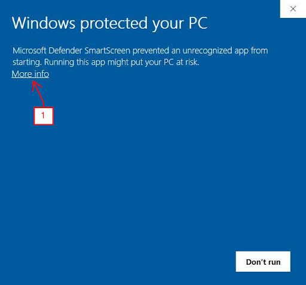
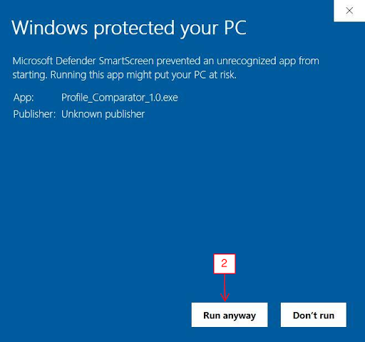

# Load Profile Comparator
## Description
Simple program that tabulates data and generates a graph between the designing (baseline) and the current heating and cooling space load profile recorded in the building system.

***Created for education purposes, but open for everyone to use. Refer to the Licence section of this README.***

## Getting Started

### Dependencies
Windows OS is currently supported. Linux and Mac OS compatibility and functionality may vary and not perform as intended.

### Execution

Download the **.exe** file under the **Assets** folder and open the file. Windows OS will prompt a warning that it is protected by the PC since the program does not contain “signed code”. Select **More Info**, then select **Click Anyway**. 

Voila! The program is ready for use!

## How To Use
Load the dataset that represents the designed or benchmarked load profile and the system load profile that needs to be evaluated (.csv files are currently supported, other data types may not be compatible).

Click the “Generate Button”. The two plots will be displayed with a graph in a separate window with the dataset tabulated in the main window.

**Note.** Detailed information of the program and the full user manual can be found [here](https://docs.google.com/document/d/1ClcJnKmzTSIvLDunIid1eV5g29stwNJC4oaI_Cu-q2A/edit?usp=sharing)!

## Changelogs

**Alpha v1.0**
- Original Release

**Alpha v2.0**
- Functionality Improvements:
    * Hide terminal window.
    * Used Matplotlib backend for plot generation.
    * Support for .csv files
    * Select datapoint on graph (visually drawn in a vertical line)

**Alpha v2.1**

- Functionality Improvements:
    * Displayed selected data points for baseline and system.

**Alpha v3.0**

- UI Improvements:
    * Change Display Data to QTableWidget() - For Pandas.
    * Split Selected Data into more points.
    * Add Grid on Matplotlib.
    * Proper Alignment of Widgets.

- Functionality Improvements:
    *  New Data Information on Overall Graph Data:
        * Maximum Cooling Load.
        * Minimum Cooling Load.
     
    * Additional Data Information on Selected Datapoint:
        * Deficit/Gain relative to the baseline.

- Code Improvements: 
    * Change .txt display to pandas df for better visibility.

**Official Release v1.0**

- Functionality Improvements:
    * Handle uneven data sizes.
    * Handle wrong data (raise error if failed).
    * Warning --> **Only CSV is currently supported**.

- UI Improvements:
    * Move Generate to the Right.
    * Add App Icon.
    * Fixed Window (Not resizeable).
    * Add link to software page --> How To and User Manual
    * Rename Graph Window Title.

**Official Release v1.1**

- Code Improvements:
    * Code is cleaned up.

- Functionality Improvements:
    * Added hours recorded on the system load profile.
    * Added hour deficit/gain on selected data.
    * Fixed link to direct to this Github repository.
    * Changed error warning to "File(s) is missing!"

- UI Improvements:
    * Selected data point is highlighted on the tables in the main window when a point is selected on graph.

## License
This project is licensed under the GNU General Public License - see the LICENSE.md file for details.

## Acknowledgements
All the trouble shooting through the forums of [Stack Overflow](https://stackoverflow.com/)!

High level GUI application design tutorial with [Tech With Tim](https://www.youtube.com/@TechWithTim)!

